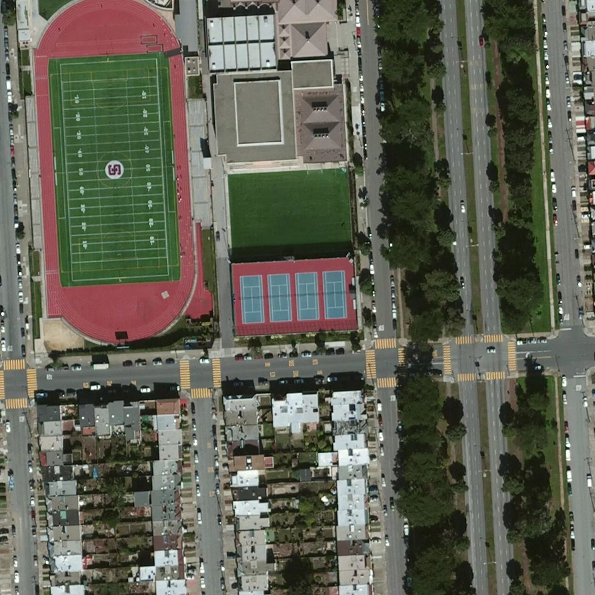
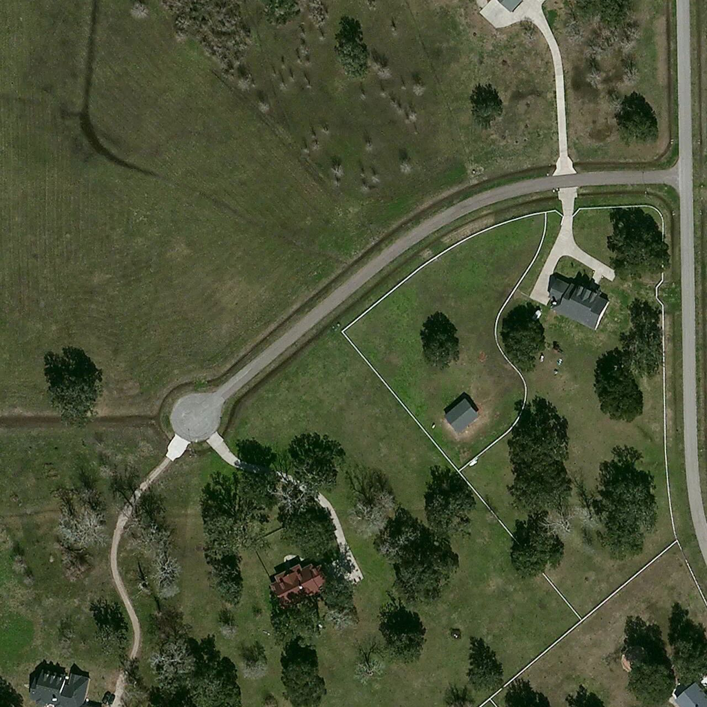
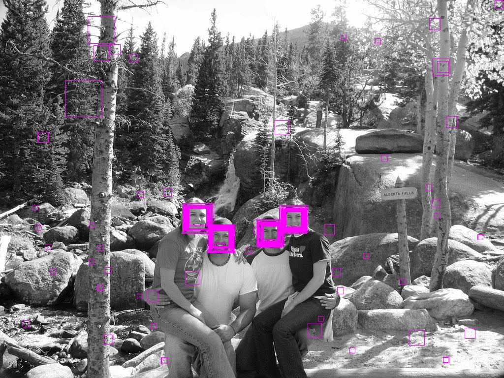
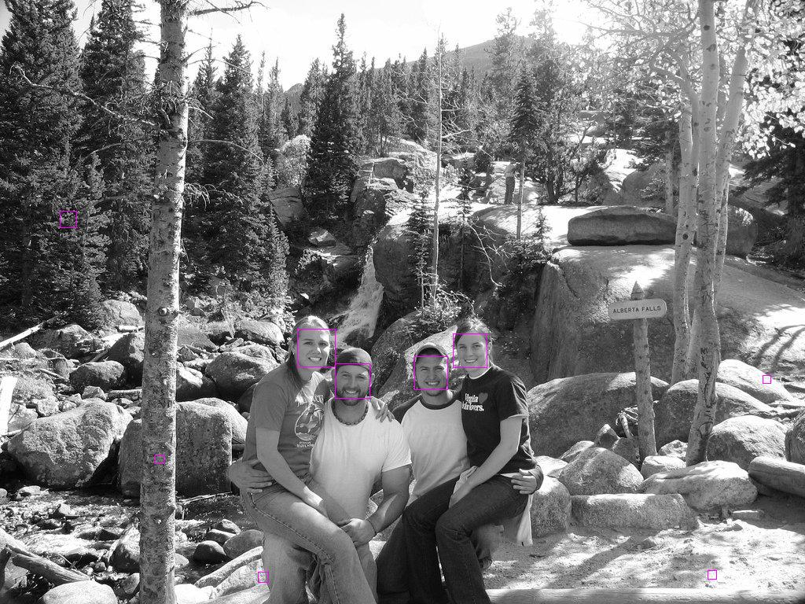
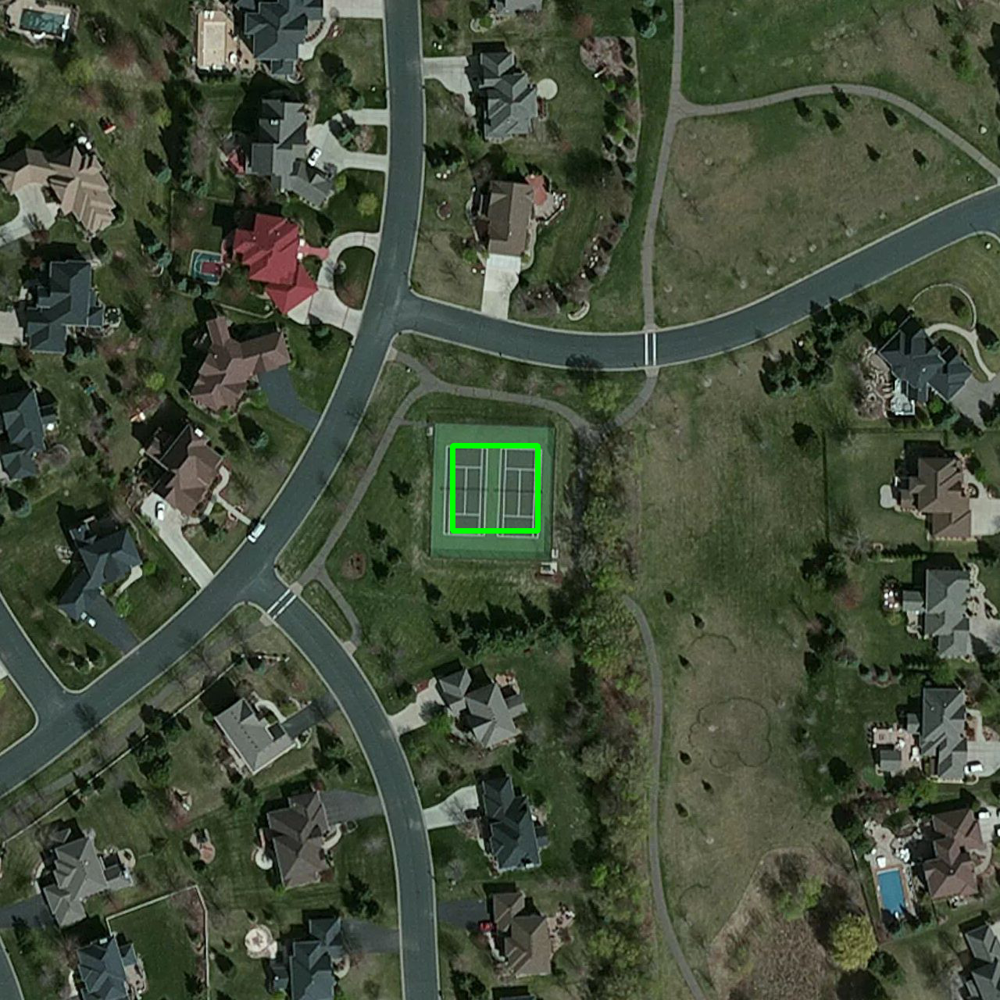
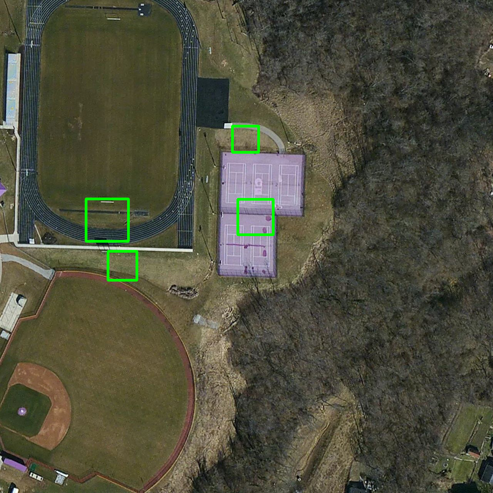
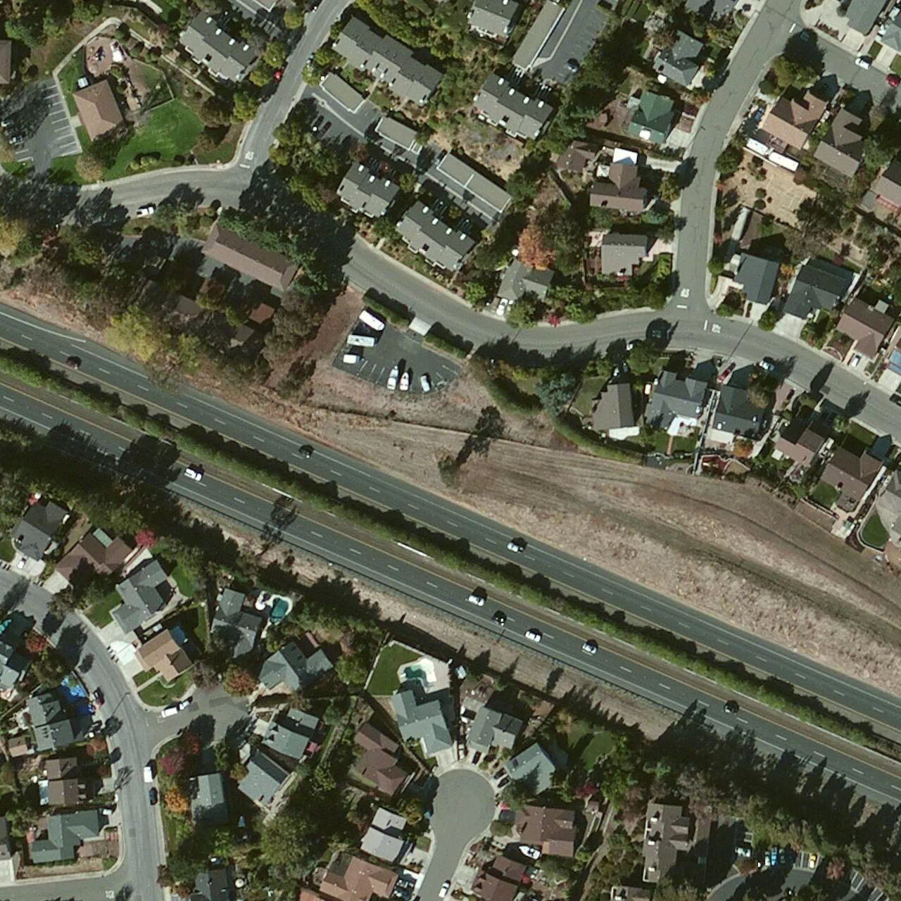
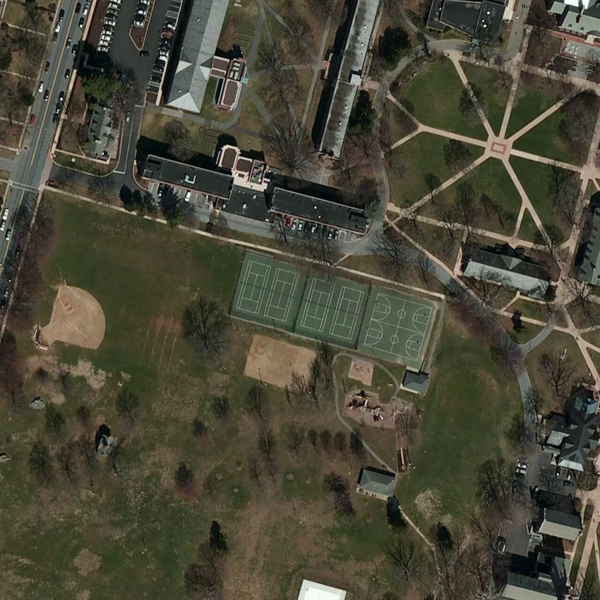
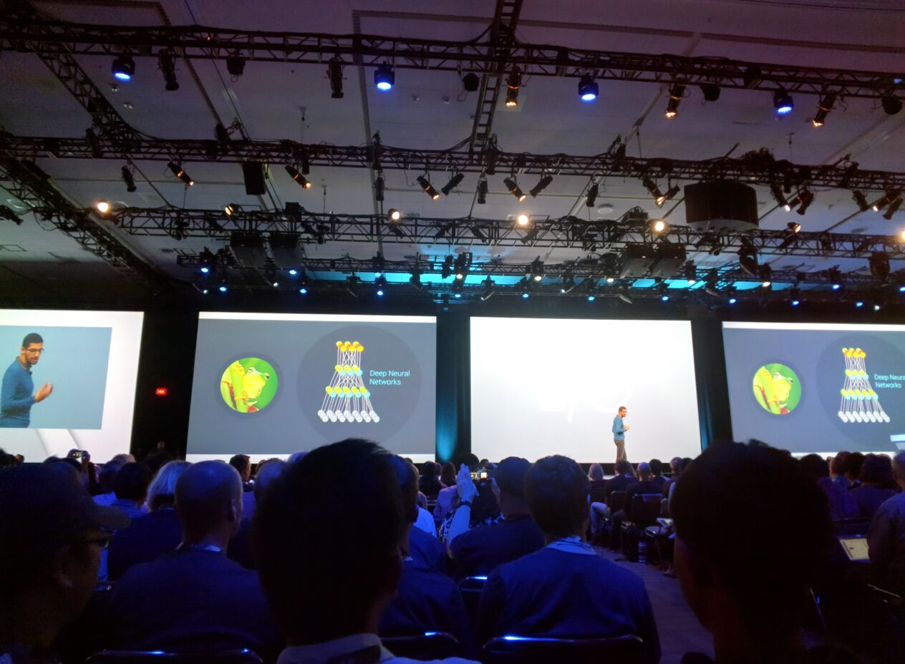

[DRAFT] Machine Learning for Development: 

A method to Learn and Identify Earth Features from Satellite Images

Prepared by Antonio Zugaldia; commissioned by the Big Data team, Innovation Labs, the World Bank

All code is MIT licensed, and the text content is CC-BY. Please feel free to send edits and updates via Pull Requests.

Foreword
=====================

“Machine Learning” is one of the tools on Big Data analysis. The need to process large amounts of data has contributed to accelerate the tools and application of new vastly scalable processing techniques. In this report we aim to facilitate the adoption of machine learning techniques to development outputs and outcomes. 

In this particular case we aim to detect automatically distinct features such as playgrounds from standard aerial images, as a milestone towards automatic detection of more refined applications like paved (or not) roads, dams, schools, hospitals, non-formal settlements, wells, different stages on agricultural crops, ...

Introduction
=========================

In this document we describe a complete methodology to detect earth features in satellite images using OpenCV, an open source computer vision and machine learning software. We describe the step by step process using documented Python software, and analyze potential ways of improving it. Finally, we review how to extend this analysis to an Apache Spark cluster hosted on AWS, and some recent developments on Google’s cloud offering. These tools can be used to analyze and visualize all kinds of data, including Sustainable Development Goals (SDG) data.[\[b\]](#cmnt2)

Computer Visions meets Machine Learning
====================================================

Machine learning[\[1\]](#ftnt1) “explores the construction and study of algorithms that can learn from and make predictions on data. Such algorithms operate by building a model from example inputs in order to make data-driven predictions or decisions, rather than following strictly static program instructions.”

Those inputs, or features, are at the core of any machine learning flow. For example, when doing a supervised regression those inputs are numbers, or when doing some document classification, we use a bag of words (where grammar is ignored or even word order but word multiplicity is kept).

However, when it comes to analyzing images, we cannot simply use the binary representation of every pixel as input. Not only this is inefficient from a memory handling perspective, raw pixels do not provide an useful representation of the content of an image, its shapes, corners, edges.

This is where Computer Vision plays a key role, extracting features from an image in order to be able to provide a useful input for machine learning algorithms. As there are many possibilities for extracting these features from images, in the following pages we are going to describe one well suited for our perspective, a cascade classifier using the open source tool OpenCV[\[2\]](#ftnt2).

Methodology
------------------------

Our goal is to be able to identify specific features from a satellite image. In other words, we need to train a supervised classification model with some input images in order to be able to predict the existence and location of that element in other satellite images.

There are many ways to accomplish. In this document we use OpenCV (Open Source Computer Vision Library), which is able to bring significant results as we will show later. OpenCV was originally developed by Intel Corporation and is an open source computer vision and machine learning software library widely adopted by the industry. It comes with a large number of algorithms and tools that serve our purpose.

We are going to focus on the cascade classifier, which has two major stages: training and detection[\[3\]](#ftnt3).

### Training

In order to train a high quality classifier we need a large number of high quality input images. For the purpose of this research, we are going to use 10,000 images acquired from the Mapbox service[\[4\]](#ftnt4) using the author’s subscription to the service. Please note that these images were only used for the purpose of this research and were never released to a larger audience.

The information about the actual geographic location of the features was obtained from OSM (OpenStreetMap). In the following pages we describe the process in detail.

All the source code mentioned in these pages is available in the GitHub repository mentioned in the references section at the end of this document. All these commands were run in a 32-CPU virtual machine running Ubuntu Linux on Google’s Cloud[\[c\]](#cmnt3) (type: n1-highcpu-32).

#### Step 1: Obtain the location of the elements

For this research, we have chosen a feature that is easily identifiable from space with abundant information in the OSM database: a tennis court. More importantly, we have chosen a feature and methodology that can be then adapted to any other features in the OSM database. Our goal is to create a flow useful for Development.

The first thing we did was to download the location of every pitch in the US available in OSM. These are technically defined by OSM by the leisure=pitch key/value. to automate this process we built a simple Python client to the Overpass API[\[5\]](#ftnt5).

The query is as follows (the cryptic (.\_;&gt;;);[\[d\]](#cmnt4) asks for the nodes and ways that are referred by the relations and ways in the result):

\[out:json\];

way

  \[leisure=pitch\]

  ({query\_bb\_s},{query\_bb\_w},{query\_bb\_n},{query\_bb\_e});

(.\_;&gt;;);

out;

Where the {query\_bb\_s},{query\_bb\_w},{query\_bb\_n},{query\_bb\_e} parameters indicate the bounding box for the US[\[6\]](#ftnt6). Because querying for every pitch in the US is too big of a query (which will make the Overpass API server to timeout), we divided the US in 100 sub-bounding boxes. This is implemented in the 01\_get\_elements.py file.

This data contains 1,265,357 nodes and 170,070 ways, an average of about 7.5 nodes per way[\[e\]](#cmnt5)[\[f\]](#cmnt6). A sample node looks like:

{"lat": 27.1460817, "lon": -114.293208, "type": "node", "id": 3070587853}

And a way looks like:

{"nodes": \[1860795336, 1860795357, 1860795382, 1860795346, 1860795336\], "type": "way", "id": 175502416, "tags": {"sport": "basketball", "leisure": "pitch"}}

We cached the results to avoid unnecessary further queries to the server. 

#### Step 2: Statistics

Once we had the data, we ran some sample statistics to see how many potential elements we had available for the US. The result is as follow, and the code is available on 02\_get\_stats.py.

Top 10 pitches types in the US according to OSM:

1.  Baseball = 61,573 ways
2.  Tennis = 38,482 ways
3.  Soccer = 19,129 ways
4.  Basketball = 15,797 ways
5.  Unknown = 11,914 ways
6.  Golf = 6,826 ways
7.  American football = 6,266 ways
8.  Volleyball = 2,127 ways
9.  Multi = 1,423 ways
10. Softball = 695 ways

As we can see, we have 38,482 pitches identified in OSM as a way in the US. This will be our pool of data to train the system. The importance of having this elements tagged as ways (and not just nodes) will be shown later.

#### Step 3: Build ways data

Next, for every way that we are interested in, we computed its centroid and its bounding box. The result is like the following and the code is in 03\_build\_ways\_data.py:

"201850880": {"lat": 48.38813308204558, "lon": -123.68852695545081, "bounds": \[48.3880748, -123.6886191, 48.3881912, -123.6884365\]}

Where 201850880 is the way ID. We use the centroid as the point where we will download the satellite imagery, and we will use the bounding box to tell the machine learning algorithm the location within the larger image where our feature of interest is located.

We used the Python Shapely library (shapely.geometry.Polygon) to compute this information.

#### Step 4: Download satellite imagery

Now that we know the location of all tennis courts in the US, we can go ahead and download some sample satellite imagery from Mapbox. This is implemented in a Python script that allows some arguments (04\_download\_satellite.py):

04\_download\_satellite.py \[-h\] \[--sport SPORT\] \[--count COUNT\]

optional arguments:

  -h, --help     show this help message and exit

  --sport SPORT  Sport tag, for example: baseball.

  --count COUNT  The total number of images to download.

For example, to download 10,000 images of tennis courts (as we did), we would run the command as follows:

$ python 04\_download\_satellite.py --sport tennis --count 10000

The images were downloaded at maximum resolution (1280x1280) in PNG format. Also, to make sure we did not introduce a bias, we randomized the list of ways before downloading the actual imagery.

Please note that in some cases[\[g\]](#cmnt7) imagery is not available in that location at that zoom level (19). Those images were identified by our script and deleted from our pool.

#### Step 5: Build samples files

Now, for every image in our set (10,000) we need to find the actual location of the tennis court in the image. From step 3 we have the bounding box coordinates, we need to transform this into an image pixel location, and output the result in a specific format required by OpenCV.

The format looks like this:

satellite/gray/pitch\_tennis\_100027097.png        1        569        457        140        365

satellite/gray/pitch\_tennis\_100040542.png        1        559        549        161        180

satellite/gray/pitch\_tennis\_100042337.png        1        464        515        350        248

satellite/gray/pitch\_tennis\_100075597.png        1        471        366        337        546

satellite/gray/pitch\_tennis\_100077768.png        1        552        551        175        176

satellite/gray/pitch\_tennis\_100089034.png        1        521        548        237        183

...

It indicates, for example, that the image satellite/gray/pitch\_tennis\_100027097.png has 1 tennis court in the box defined by the bounding rectangle (569, 457, 140, 365). In all cases, we checked that the bounding rectangle was not larger than the image dimensions (1280x1280 pixels), or too small (less than 25x25 pixels), something entirely possible if they were incorrectly labeled by the OSM editor.

[\[h\]](#cmnt8)

Also, note that this point we converted all images to grayscale (grayscale images are assumed by OpenCV’s scripts).

In order to convert from earth coordinates to image coordinates we used the following Python method:

def get\_rectangle(bounds):

    \# This converts a latitude delta into an image delta.

    \# For USA, at zoom level 19, we know that we have 0.21

    \# meters/pixel. So, an image is showing

    \# about 1280 pixels \* 0.21 meters/pixel = 268.8 meters.

    \# On the other hand we know that at the same angle,

    \# a degrees in latlon is

    \# (https://en.wikipedia.org/wiki/Latitude):

    \# latitude = 111,132 m

    \# longitude = 78,847 m

    latitude\_factor  = 111132.0 / 0.21

    longitude\_factor = 78847.0 / 0.21

    \# Feature size

    feature\_width = longitude\_factor \*

       math.fabs(bounds\[1\] - bounds\[3\])

    feature\_height = latitude\_factor \*

       math.fabs(bounds\[0\] - bounds\[2\])

    \# CV params (int required)

    x = int((image\_width / 2) - (feature\_width / 2))

    y = int((image\_height / 2) - (feature\_height / 2))

    w = int(feature\_width)

    h = int(feature\_height)

    return x, y, w, h

The correspondence between meters and pixel is shown in the following table (courtesy of Bruno Sánchez-Andrade Nuño):

<table style="width:100%;">
<colgroup>
<col width="14%" />
<col width="14%" />
<col width="14%" />
<col width="14%" />
<col width="14%" />
<col width="14%" />
<col width="14%" />
</colgroup>
<tbody>
<tr class="odd">
<td align="left">

</td>
<td align="left">
Latitude
</td>
<td align="left">

</td>
<td align="left">

</td>
<td align="left">

</td>
<td align="left">

</td>
<td align="left">

</td>
</tr>
<tr class="even">
<td align="left">
Zoom level
</td>
<td align="left">
0
</td>
<td align="left">
15
</td>
<td align="left">
30
</td>
<td align="left">
45
</td>
<td align="left">
60
</td>
<td align="left">
75
</td>
</tr>
<tr class="odd">
<td align="left">
15
</td>
<td align="left">
4.78
</td>
<td align="left">
4.61
</td>
<td align="left">
4.14
</td>
<td align="left">
3.38
</td>
<td align="left">
2.39
</td>
<td align="left">
1.24
</td>
</tr>
<tr class="even">
<td align="left">
16
</td>
<td align="left">
2.39
</td>
<td align="left">
2.31
</td>
<td align="left">
2.07
</td>
<td align="left">
1.69
</td>
<td align="left">
1.19
</td>
<td align="left">
0.62
</td>
</tr>
<tr class="odd">
<td align="left">
17
</td>
<td align="left">
1.19
</td>
<td align="left">
1.15
</td>
<td align="left">
1.03
</td>
<td align="left">
0.84
</td>
<td align="left">
0.60
</td>
<td align="left">
0.31
</td>
</tr>
<tr class="even">
<td align="left">
18
</td>
<td align="left">
0.60
</td>
<td align="left">
0.58
</td>
<td align="left">
0.52
</td>
<td align="left">
0.42
</td>
<td align="left">
0.30
</td>
<td align="left">
0.15
</td>
</tr>
<tr class="odd">
<td align="left">
19
</td>
<td align="left">
0.30
</td>
<td align="left">
0.29
</td>
<td align="left">
0.26
</td>
<td align="left">
0.21
</td>
<td align="left">
0.15
</td>
<td align="left">
0.08
</td>
</tr>
<tr class="even">
<td align="left">
20
</td>
<td align="left">
0.15
</td>
<td align="left">
0.14
</td>
<td align="left">
0.13
</td>
<td align="left">
0.11
</td>
<td align="left">
0.07
</td>
<td align="left">
0.04
</td>
</tr>
<tr class="odd">
<td align="left">

</td>
<td align="left">

</td>
<td align="left">

</td>
<td align="left">

</td>
<td align="left">

</td>
<td align="left">

</td>
<td align="left">

</td>
</tr>
<tr class="even">
<td align="left">

</td>
<td align="left">
Ecuator
</td>
<td align="left">
Central America, India, North Australia, South Brazil
</td>
<td align="left">
Mexico, South US, South Australia, South Africa
</td>
<td align="left">
New Zealand, North US, most Europe, Tip of Argentina/Chile
</td>
<td align="left">
Russia, North Europe, Canada
</td>
<td align="left">
Polar bears
</td>
</tr>
</tbody>
</table>

#### Step 6: Get negatives

A training process is incomplete if we don’t have “negatives”, that is, images used as a bad example were no features are present. To solve this we built the following script:

python 06\_get\_negatives.py \[-h\] \[--count COUNT\]

optional arguments:

  -h, --help     show this help message and exit

  --count COUNT  The total number of negative images to download.

We can use it like:

$ python 06\_get\_negatives.py --count 1000

It basically loads some random locations with actual pitches, but moves the location by a random amount to get the features out of the image:

target\_lat = element.get('lat') + (random.random() - 0.5)

target\_lon = element.get('lon') + (random.random() - 0.5)

Finally, we just need to put them all in one file with the following format:

satellite/negative/negative\_1000200409.png

satellite/negative/negative\_1001251446.png

satellite/negative/negative\_1001532469.png

satellite/negative/negative\_1001687068.png

satellite/negative/negative\_1004891593.png

satellite/negative/negative\_1006295843.png

satellite/negative/negative\_1009904689.png

satellite/negative/negative\_1011863337.png

...

In this case we don’t need to specify a bounding rectangle as these are images with no features in it.

#### Step 7: Actual training phase

We are finally equipped to use OpenCV’s tools to train the cascade classifier. First we need to create a .vec file using opencv\_createsamples:

$ opencv\_createsamples -info info\_tennis.dat -num 10000 -vec info\_tennis.vec

This would create the .vec file using 10,000 samples. And then, we can do the actual training with opencv\_traincascade:

$ opencv\_traincascade -data output -vec info\_tennis.vec -bg negative.txt -numPos 2000 -numNeg 1000

This instructs to use 2,000 positive images, and 1,000 negative images (the default) and write the result in the output folder.

This is by far the most computing intensive step of the process. We ran it for different positive/negative values and the total time for the virtual machine ranged from a few hours (for about 2,000 positive images, default) to 5 days (for 8,000 positive images). 

### Detection

We now have a trained classifier in the form of a XML file that OpenCV can use to detect features in our images (we provide the resulting XML in the repository). Its usage can be as simple as:

tennis\_cascade\_file = 'output/cascade-8000-4000.xml'

tennis\_cascade = cv2.CascadeClassifier(tennis\_cascade\_file)

img = cv2.imread(filename, 0)

pitches = tennis\_cascade.detectMultiScale(

  img, minNeighbors=min\_neighbors)

Where filename represents the satellite image we want to analyze and pitches contain the location (if detected) of the feature in the image.

#### Step 8: Optimizing parameters

However, the cascade classifier has different parameters that will affect the result of the classification. A key parameter is minNeighbors, a parameter specifying how many neighbors each candidate rectangle should have to retain it.

For example[\[7\]](#ftnt7), if we were using this methodology to identify faces in a picture, and we set the minNeighbors value as zero, we would get too many false positives:

A larger value of minNeighbors, will bring a better result:

This is way, at this point we spent some time finding the value that brings the best results for us. A common way of approaching this situation is by defining:

-   True positive: “There is a tennis court, and we found one.”
-   False positive: “There is no tennis court, and we found one.”
-   True negative: “There is no tennis court, and we found none.”
-   False negative: “There is a tennis court, and we found none.”

In general, we are interested in maximizing true positives and true negatives, and minimizing false positives and false negatives. It is up to us to decide to what extent we want to do this. For example, in an algorithm to detect brain tumors we might want to focus on minimizing false negatives (missing an existing tumor), while in a crowdsourced system (like it could be this one), is better to target false positives because they are easy to dismiss by a human.

Knowing this, we obtained 100 random images with tennis courts in them, and 100 random images with no tennis courts, and we used our model to check for the existence or inexistence of a tennis court on them, calculating in every case the total number of courts identified. This is done by 07\_fit\_min\_neighbors.py and 08\_plot\_fit.py and one of the results is the following:

This image was computed with the 4,000 positive images and 2,000 negative images. The red lines indicates the number of pitches detected in negative images as we increase minNeighbors, and the blue line does the same for positive images. The goal, is to make sure that the red line falls under the value of one (green dashed line = no pitches identified) while the blue one remains above one. This seems to happen when the value minNeighbors of goes over 300.

In fact, for a minNeighbors value of 500, we obtain:

-   Percentage of true positives = 73.0%
-   Percentage of true negatives = 82.0%

Which seems to indicate we are going on the right direction. Further analysis will require to compute precision (how accurate our positive predictions are) and recall (what fractions of the positives our model identified) values.

#### Step 9: Visualizing results[\[i\]](#cmnt9)

Finally, we have built 09\_draw\_results.py to visualize the predictions of our model. These are some actual results on images not included in the original training set:

True positive:

False positive:

True negative:

False negative:

#### Next steps

As we have shown until now, the cascade classifier is producing solid results over our training dataset, however, not all features in the world are as identifiable as a tennis court (a specific type of building, for example), or as available in the OSM database (low interest objects, or very recent ones after a natural disaster, for example).

Because of these challenges, there are a number of improvements that still could be explored. Namely:

-   Train the model with a larger dataset: We have used thousands of images to train the system. While this is not a small number, this is far from being “big data.” In the next section we describe how to scale this process to cluster size processing, making this virtually limitless for the number of images we would be capable of analyzing.
-   Test the model with a different OSM feature: We have tried one particular feature but, as usual, we only learn how to generalize a method when we have tried a set of them. Applying this methodology to other OSM features would likely improve the overall fitting.
-   Correcting the bounding box orientation: In the images, it’s rare that all the tennis courts are aligned in the same way, using the bounding box to rotate all features to have the same alignment would help algorithms where this is important (unlike local feature detector described below).
-   Better features: We are using the bounding box to define the object we want to identify. However, but for more complex elements we might want to be more precise than that. This might require manual editing of every training image, but the better the training set, the better the results.

<!-- -->

-   Other algorithms: We have used opencv\_traincascade, that supports both Haar and LBP (Local Binary Patterns) features but these are not the only ones. Two specific detectors that could be of use in this case are SIFT[\[8\]](#ftnt8), and SURF[\[9\]](#ftnt9), a local feature detector. These detectors improve extraction from the training image even under changes in image scale, noise and illumination, which is likely to happen in satellite imagery.

Setting up a cluster computing system with Apache Spark
====================================================================

In the previous section, we mentioned that one obvious improvement to our machine learning flow is to substantially increase the number of images we have used for training purposes, or as Herman Narula[\[10\]](#ftnt10) says: “the cool stuff only happens at scale”. In order to do this, we need a tool like Apache Spark to handle the extra load. Just relying on a more powerful machine VM won’t be enough for practical reasons.

In the following pages we show how to deploy a Spark Cluster in Amazon’s cloud, and how to run a simple mapreduce job. This is a cost efficient way of running Spark and a popular solution among startups. Other possibilities include platforms as service (PaaS) like Databricks[\[11\]](#ftnt11) (founded by the creators of Spark), or IBM Bluemix[\[12\]](#ftnt12). This last approach is not covered in this document.

Apache Spark is a fast and general cluster computing system for big data that brings considerable performance improvements over existing tools. It was developed by the AMPLab[\[13\]](#ftnt13) at UC Berkeley and, unlike Hadoop[\[14\]](#ftnt14), “Spark's in-memory primitives provide performance up to 100 times faster for certain applications. By allowing user programs to load data into a cluster's memory and query it repeatedly, Spark is well suited to machine learning algorithms.”

Technically, from the official documentation:

“Spark is a fast and general-purpose cluster computing system. It provides high-level APIs in Java, Scala and Python, and an optimized engine that supports general execution graphs. It also supports a rich set of higher-level tools including Spark SQL for SQL and structured data processing, MLlib for machine learning, GraphX for graph processing, and Spark Streaming.”

According to Spark inventor and MIT professor, Matei Zaharia, Spark is one of the most active and fastest growing open source big data cluster computing projects[\[15\]](#ftnt15). Spark is supported by both Amazon’s and Google’s cloud, and it starting to have strong industry support[\[16\]](#ftnt16).

Setting up Apache Spark
------------------------------------

We can install Spark on our laptop (or desktop computer) downloading one of the binaries available on the download page[\[17\]](#ftnt17), Spark runs on both Windows and UNIX-like systems (e.g. Linux, Mac OS). The only requirement is to have an installation of Java[\[18\]](#ftnt18) 6+ on your computer (Spark is written in Scala and runs on the Java Virtual Machine). Also, we need a Python[\[19\]](#ftnt19) 2.7+ interpreter in order to run the scripts we will show in the following sections.

Follow these steps:

1.  Head to the downloads page.
2.  In “Choose a Spark release” choose the latest version available.
3.  In “Choose a package type” choose a “pre-built for Hadoop” version.
4.  Leave “Choose a download type” on its default value.
5.  Click on the “Download Spark” link and download the actual file.

Once you’ve downloaded the package, simply unpack it:

$ cd /your/target/folder

$ tar zxf spark-1.3.1-bin-hadoop2.4.tgz

$ cd spark-1.3.1-bin-hadoop2.4

You can verify that Spark is installed correctly running a sample application[\[20\]](#ftnt20):

$ ./bin/spark-submit examples/src/main/python/pi.py 10

You will see a long list of logging statements, and an output like the following:

Pi is roughly 3.142360

Although, as we can see, Spark can be run on someone’s laptop (or desktop computer, which is useful to prototype or quickly explore a dataset), its full potential comes when it’s run as part of a distributed cluster. Let’s see now a couple of ways we can use to run Spark on Amazon AWS (for real-world data analysis).

Running Spark on AWS Elastic Compute Cloud (EC2)
-------------------------------------------------------------

The official Spark distribution includes a script[\[21\]](#ftnt21) that simplifies the setup of Spark Clusters on EC2. This script uses Boto[\[22\]](#ftnt22) behind the scenes so you might want to set up your boto.cfg file so that you don’t have to type your aws\_access\_key\_id and aws\_secret\_access\_key every time.

Let’s assume that we have created a new keypair (ec2-keypair) with the AWS Console, and that we have saved it in a file (ec2-keypair.pem) with the right permissions (chmod 600). We are now going to create a 10 machines cluster called worldbank-cluster (please note that this will incur in some costs):

$ ./ec2/spark-ec2 \\

    --key-pair=ec2-keypair \\

    --identity-file=ec2-keypair.pem \\

    --slaves=10 \\

    launch worldbank-cluster

Once the cluster is created (it will take a few minutes), we can login (via SSH) to our brand new cluster with the following command:

$ ./ec2/spark-ec2 \\

    --key-pair=ec2-keypair \\

    --identity-file=ec2-keypair.pem \\

    login worldbank-cluster

And we can run the same example code (or any other Spark application) with:

$ cd spark

$ ./bin/spark-submit examples/src/main/python/pi.py 10

(Spark comes pre-installed[\[23\]](#ftnt23) on /root/spark.)

Remember to destroy the cluster once you’re done with it:

$ ./ec2/spark-ec2 \\

    --delete-groups \\

    destroy worldbank-cluster

You could also stop (./ec2/spark-ec2 stop worldbank-cluster) and start (./ec2/spark-ec2 stop worldbank-cluster) the cluster without having to destroy it.

Running Spark on AWS EMR (Elastic MapReduce)[\[24\]](#ftnt24)
-------------------------------------------------------------------------------------

Because Spark is compatible with Apache Hadoop[\[25\]](#ftnt25) we can use EMR as our Spark cluster for data processing. We are going to use the AWS command line interface[\[26\]](#ftnt26) to manage this new EMR, cluster and we assume you have it installed.

Before creating the cluster, make sure that you have created the default roles (this is a one-time setup command):

$ aws emr create-default-roles

Then, you can create the cluster with this command (again called worldbank-cluster with 10 machines).

$ aws emr create-cluster \\

    --name worldbank-cluster \\

    --ami-version 3.7.0 \\

    --instance-type m3.xlarge \\

    --instance-count 10 \\

    --ec2-attributes KeyName=ec2-keypair \\

    --applications Name=Hive \\

    --use-default-roles \\

    --bootstrap-actions \\

      Path=s3://support.elasticmapreduce/spark/install-spark

Make sure you take note of the cluster ID (for example, j-1A2BCD34EFG5H). Again, take into account this could incur in Amazon AWS costs.

If you are already familiar with AWS and AWS EMR, you will notice that this is a pretty standard setup. The big difference is in the last line, that includes the S3 location for the Spark installation bootstrap action.

You can then perform the usual tasks on EMR clusters, like describe:

$ aws emr describe-cluster \\

    --cluster-id j-1A2BCD34EFG5H

or list instances:

$ aws emr list-instances \\

    --cluster-id j-1A2BCD34EFG5H

Once the EMR cluster has been created (it will take a few minutes), you can login via SSH, like we did in the previous section:

$ aws emr ssh \\

    --cluster-id j-1A2BCD34EFG5H \\

    --key-pair-file ec2-keypair.pem

And execute your Spark application with:

$ cd spark

$ ./bin/spark-submit examples/src/main/python/pi.py 10

(Spark comes pre-installed on /home/hadoop.)

Finally, you can terminate the cluster with:

$ aws emr terminate-clusters \\

    --cluster-id j-1A2BCD34EFG5H

Machine Learning on Google’s Cloud
===============================================

During the time of this assignment, Google held its annual developer conference, Google I/O 2015, where [machine learning related topics](https://www.google.com/url?q=http://techcrunch.com/2015/05/31/io-spotlights-googles-machine-learning-smarts/?ncid%3Drss%23.1j7bir:c0bG&sa=D&usg=AFQjCNGk_DlCQ7MKWYhZC8nydEHTMyRAMg) were at the core of the new products and development. This section summarizes the current status of tools on Google’s Cloud to support machine learning processes and some of the announcements made during the conference.

New developments
-----------------------------

During the conference keynote, machine learning was mentioned directly (“machine learning”) or indirectly (“computer vision”, “natural language processing”, “deep neural networks”) about a dozen times. This can be visualized in the following word cloud that we have built[\[27\]](#ftnt27) where the terms “machine” and “learning” are highlighted:

Products
---------------------

The two main products benefitting from recent machine learning developments at Google, as stated during the keynote, are:

1.  Google Photos[\[28\]](#ftnt28). This new service is now available, and its search input is the main point of access for computer vision and machine learning functionality. Users can search by person, or image content, for example.
2.  Google Now and Google Now on Tap[\[29\]](#ftnt29). This new product will be present in the future version of Android M, still unpublished.

Source: Google

Technologies
-------------------------

Unfortunately, Google is not releasing much information about the actual technologies they are using in their machine learning efforts. The exception might be deep neural networks. This is a quote from Sundar Pichai, Senior Vice President at Google for Android, Chrome, and Google Apps, during the keynote:

“You know, in this query, what looked like a simple query, we understood voice, we did natural language processing, we are doing image recognition, and, finally, translation, and making it all work in an instant. The reason we are able to do all of this is thanks to the investments we have made in machine learning. Machine learning is what helps us answer the question, what does a tree frog look like, from millions of images around the world. You know, the computers can go through a lot of data and understand patterns. It turns out the tree frog is actually the third picture there. The reason we are able to do that so much better in the last few years is thanks to an advance in the technology called deep neural nets. Deep neural nets are a hierarchical, layered learning system. So we learn in layers. The first layer can understand lines and edges and shadows and shapes. A second layer may understand things like like ears, legs, hands, and so on. And the final layer understands the entire image. We have the best investment in machine learning over the past many years, and we believe we have the best capability in the world. Our current deep neural nets are over 30 layers deep. It is what helps us when you speak to Google, our word error rate has dropped from a 23% to 8% in just over a year and that progress is due to our investment in machine learning.”

Artificial neural networks are a well known architecture in deep learning[\[30\]](#ftnt30).

Deep neural networks during Google I/O 2015 keynote[\[31\]](#ftnt31)

Lack of new developer options
------------------------------------------

Unfortunately, the new products announced by Google are not immediately accompanied by new developer tools that we could benefit from to create advanced machine learning processing in an easier way, leveraging Google’s infrastructure.

We had conversations with Google engineers and Google Developer Experts and these are a few items we learned:

-   No immediate announcements regarding new machine learning tools, related or not to the new Google Now on Tap product.
-   No immediate announcements regarding new computer vision tools related to the new Google Photos product.
-   The Prediction API remains the recommended tool for machine learning in the cloud with a 99.9% availability service level agreement.
-   The Prediction API is better suited for numeric or text input that can output hundreds of discrete categories or continuous values. It is unclear the algorithms used by Google in order to generate the predictions.
-   Computer Vision analysis requires custom tools on top of Google Compute Engine (the equivalent of Amazon’s EC2). Preemptible VMs (instances that might be terminated, or preempted, at any moment) remain the best option for affordable computing and are a common solution.
-   Geographic analysis requires custom tools on top of Google Compute Engine as Cloud SQL has no support for PostgreSQL (and therefore, PostGIS). The Google Maps API for Work product is better suited for visualization than analysys. Internally, Google seems to solve this problem with Spanner[\[32\]](#ftnt32).
-   An alternative to GCE is the Container Engine, that allows to run Docker containers on Google Cloud Platform, powered by Kubernetes[\[33\]](#ftnt33). Google Container Engine schedules containers, based on declared needs, on a managed cluster of virtual machines.

Current tools
--------------------------

Finally, and in order to be comprehensive, these are the current tools that Google provides for machine learning and big data as part of their cloud offering:

-   BigQuery: Analyzes Big Data in the cloud, it runs fast, SQL-like queries against multi-terabyte datasets in seconds. Gives real-time insights about data.
-   Dataflow (beta): Builds, deploys, and runs data processing pipelines that scales to solve key business challenges. It enables reliable execution for large-scale data processing scenarios such as ETL, analytics, real-time computation, and process orchestration.
-   Pub/Sub (beta): Connects services with reliable, many-to-many, asynchronous messaging hosted on Google's infrastructure. Cloud Pub/Sub automatically scales as needed and provides a foundation for building global services.
-   Prediction API: Uses Google’s machine learning algorithms to analyze data and predict future outcomes using a RESTful interface.

### Discount code

If there’s any interest in trying any of these technologies, we can provide a $500 discount code that was shared with attendees. To redeem it, please follow the following instructions (this offer must be claimed by June 15th):

1.  Go to [http://g.co/CloudStarterCredit](https://www.google.com/url?q=http://g.co/CloudStarterCredit&sa=D&usg=AFQjCNHV7f68FPlu6ivUgok5wpalZ5GlLA) 
2.  Click Apply Now
3.  Complete the form with code: GCP15

Reference Materials
================================

Finally, we present a few references that can help the reader deepen their knowledge of all the areas mentioned in this report.

Code
-----------------

We have set a GitHub repository[\[34\]](#ftnt34) for the code of this project:

-   Machine Learning for Dev: [https://github.com/zugaldia/ml4dev](https://www.google.com/url?q=https://github.com/zugaldia/ml4dev&sa=D&usg=AFQjCNErj_8y8tyVdStsBD3Jun7quMAijQ) 

Books
------------------

These are a few good books that expand on the tools and methodologies that we’ve used throughout this document:

-   [Data Science from Scratch: First Principles with Python](https://www.google.com/url?q=http://shop.oreilly.com/product/0636920033400.do&sa=D&usg=AFQjCNENjJbXwVvzp9Sqk-6NPIjwh48WIg), by Joel Grus. Publisher: O'Reilly Media (release Date: April 2015).
-   [Learning Spark: Lightning-Fast Big Data Analysis](https://www.google.com/url?q=http://shop.oreilly.com/product/0636920028512.do&sa=D&usg=AFQjCNGs5b-zdPdgC0N9wet5JKOmD5CQOg), by Holden Karau, Andy Konwinski, Patrick Wendell, Matei Zaharia. Publisher: O'Reilly Media (release Date: January 2015).
-   [Advanced Analytics with Spark: Patterns for Learning from Data at Scale](https://www.google.com/url?q=http://shop.oreilly.com/product/0636920035091.do&sa=D&usg=AFQjCNGlWxc1KMa_BjQCJxGbQHfPtacwwg), by Sandy Ryza, Uri Laserson, Sean Owen, Josh Wills. Publisher: O'Reilly Media (release Date: April 2015).

Websites
---------------------

-   [Apache Spark](https://www.google.com/url?q=https://spark.apache.org/&sa=D&usg=AFQjCNG9LgiHTP_hHJlTAXB47N4q-Qt2JQ): Fast and general engine for large-scale data processing.
-   [Mahotas](https://www.google.com/url?q=http://mahotas.readthedocs.org&sa=D&usg=AFQjCNGo5xI_v4uQvHWhBAe7O7xONdY1nA): Computer Vision in Python.
-   [OpenCV](https://www.google.com/url?q=http://www.opencv.org&sa=D&usg=AFQjCNGYk_Njg5BHJmfZ6hC25FKoieSp-g) (Open Source Computer Vision Library): An open source computer vision and machine learning software library.
-   [scikit-learn](https://www.google.com/url?q=http://scikit-learn.org&sa=D&usg=AFQjCNH2dhhb4jUPTAd-U-W3EOulW_AWEw): Machine Learning in Python.

------------------------------------------------------------------------

[\[1\]](#ftnt_ref1) [https://en.wikipedia.org/wiki/Machine\_learning](https://www.google.com/url?q=https://en.wikipedia.org/wiki/Machine_learning&sa=D&usg=AFQjCNGyHrOE0j7i4QL3JdG19NXl_90r3A) 

[\[2\]](#ftnt_ref2) [http://www.opencv.org](https://www.google.com/url?q=http://www.opencv.org&sa=D&usg=AFQjCNGYk_Njg5BHJmfZ6hC25FKoieSp-g) 

[\[3\]](#ftnt_ref3) This process is described in detail here: [http://docs.opencv.org/doc/user\_guide/ug\_traincascade.html](https://www.google.com/url?q=http://docs.opencv.org/doc/user_guide/ug_traincascade.html&sa=D&usg=AFQjCNG3Eb-gzh-2tq1R9sp1VZOSSeqD-Q) 

[\[4\]](#ftnt_ref4) [https://www.mapbox.com/commercial-satellite/](https://www.google.com/url?q=https://www.mapbox.com/commercial-satellite/&sa=D&usg=AFQjCNGFCHNLJBqqFl8-wIe83acCV3_TjA) 

[\[5\]](#ftnt_ref5) [http://wiki.openstreetmap.org/wiki/Overpass\_API](https://www.google.com/url?q=http://wiki.openstreetmap.org/wiki/Overpass_API&sa=D&usg=AFQjCNFizwee0VtdA_2nr6BTWMeO_XqveA) 

[\[6\]](#ftnt_ref6) [https://www.flickr.com/places/info/24875662](https://www.google.com/url?q=https://www.flickr.com/places/info/24875662&sa=D&usg=AFQjCNHrFDwaXx9x2QzG0zseDrj0dwRMJQ) 

[\[7\]](#ftnt_ref7) OpenCV detectMultiScale() minNeighbors parameter: [http://stackoverflow.com/questions/22249579/opencv-detectmultiscale-minneighbors-parameter](https://www.google.com/url?q=http://stackoverflow.com/questions/22249579/opencv-detectmultiscale-minneighbors-parameter&sa=D&usg=AFQjCNG4ACJg-odMBGSN8T_yTZ3wRr-ZBw) 

[\[8\]](#ftnt_ref8) [http://opencv-python-tutroals.readthedocs.org/en/latest/py\_tutorials/py\_feature2d/py\_sift\_intro/py\_sift\_intro.html](https://www.google.com/url?q=http://opencv-python-tutroals.readthedocs.org/en/latest/py_tutorials/py_feature2d/py_sift_intro/py_sift_intro.html&sa=D&usg=AFQjCNHryI2TAtd3R0mwjLZgWijmRcFwSw) 

[\[9\]](#ftnt_ref9) [http://opencv-python-tutroals.readthedocs.org/en/latest/py\_tutorials/py\_feature2d/py\_surf\_intro/py\_surf\_intro.html](https://www.google.com/url?q=http://opencv-python-tutroals.readthedocs.org/en/latest/py_tutorials/py_feature2d/py_surf_intro/py_surf_intro.html&sa=D&usg=AFQjCNHEZg-KgtHV9br4m7XxRXwYtKn0DA) 

[\[11\]](#ftnt_ref11) [https://databricks.com/](https://www.google.com/url?q=https://databricks.com/&sa=D&usg=AFQjCNH0J9dnhfqQ9UFBME7LxhKHBExp4A) 

[\[12\]](#ftnt_ref12) [https://developer.ibm.com/bluemix/](https://www.google.com/url?q=https://developer.ibm.com/bluemix/&sa=D&usg=AFQjCNG4uwjhYhxDIt03MqNb12wW72TxEQ) 

[\[13\]](#ftnt_ref13)Algorithms, Machines, and People Lab: [https://amplab.cs.berkeley.edu](https://www.google.com/url?q=https://amplab.cs.berkeley.edu&sa=D&usg=AFQjCNHaV5sMRCGT2D6EL_TjHEC6_Z2wdA) 

[\[14\]](#ftnt_ref14) [https://en.wikipedia.org/wiki/Apache\_Spark](https://www.google.com/url?q=https://en.wikipedia.org/wiki/Apache_Spark&sa=D&usg=AFQjCNGnQS88pnPs4s1kLPU2U2yEPrMRng) 

[\[15\]](#ftnt_ref15) “Andreessen Horowitz Podcast: A Conversation with the Inventor of Spark”: [http://a16z.com/2015/06/24/a16z-podcast-a-conversation-with-the-inventor-of-spark/](https://www.google.com/url?q=http://a16z.com/2015/06/24/a16z-podcast-a-conversation-with-the-inventor-of-spark/&sa=D&usg=AFQjCNH1TEIJ0nFleR2v1rA0uKbAX3umZQ) 

[\[16\]](#ftnt_ref16) “IBM Pours Researchers And Resources Into Apache Spark Project”: [http://techcrunch.com/2015/06/15/ibm-pours-researchers-and-resources-into-apache-spark-project/](https://www.google.com/url?q=http://techcrunch.com/2015/06/15/ibm-pours-researchers-and-resources-into-apache-spark-project/&sa=D&usg=AFQjCNHFFm6S1kbJf8kiWt4EpT4GJOIn7w) 

[\[17\]](#ftnt_ref17) [https://spark.apache.org/downloads.html](https://www.google.com/url?q=https://spark.apache.org/downloads.html&sa=D&usg=AFQjCNF223tQufgI-bWJK-L9XL1y_YYetw) 

[\[18\]](#ftnt_ref18) [https://java.com/en/download/](https://www.google.com/url?q=https://java.com/en/download/&sa=D&usg=AFQjCNFODbfMl1s6o1TMuWM5O6KxFdlMpg) 

[\[19\]](#ftnt_ref19) [https://www.python.org/downloads/](https://www.google.com/url?q=https://www.python.org/downloads/&sa=D&usg=AFQjCNEtGL1pmazbD2Cn8kP82nW08hA9mA) 

[\[20\]](#ftnt_ref20) [https://github.com/apache/spark/blob/master/examples/src/main/python/pi.py](https://www.google.com/url?q=https://github.com/apache/spark/blob/master/examples/src/main/python/pi.py&sa=D&usg=AFQjCNHzshMJcsWnpLjRAm6jU0IUUSTXSA) 

[\[21\]](#ftnt_ref21) [https://spark.apache.org/docs/latest/ec2-scripts.html](https://www.google.com/url?q=https://spark.apache.org/docs/latest/ec2-scripts.html&sa=D&usg=AFQjCNG4InBUVPt2CaH0cTVZ9cBWbKK4rQ) 

[\[22\]](#ftnt_ref22) [http://aws.amazon.com/sdk-for-python/](https://www.google.com/url?q=http://aws.amazon.com/sdk-for-python/&sa=D&usg=AFQjCNHZ3SpFZOvZsKvEg5Aht_doQU-ZoQ) 

[\[23\]](#ftnt_ref23)Together with ephemeral-hdfs, hadoop-native, mapreduce, persistent-hdfs, scala, and tachyon.

[\[24\]](#ftnt_ref24) After this section was written, Amazon announced [improved support for Apache Spark on EMR](https://www.google.com/url?q=http://aws.amazon.com/elasticmapreduce/details/spark/&sa=D&usg=AFQjCNFw_bLgw2IkTVfXFRi7mQHmgfoVbw). We can now create an Amazon EMR cluster with Apache Spark from the AWS Management Console, AWS CLI, or SDK by choosing AMI 3.8.0 and adding Spark as an application. Amazon EMR currently supports Spark version 1.3.1 and utilizes Hadoop YARN as the cluster manager. To submit applications to Spark on your Amazon EMR cluster, you can add Spark steps with the Step API or interact directly with the Spark API on your cluster's master node.

[\[25\]](#ftnt_ref25) In fact, Spak can run in Hadoop clusters through YARN or Spark's standalone mode, and it can process data in HDFS, HBase, Cassandra, Hive, and any Hadoop InputFormat.

[\[26\]](#ftnt_ref26) [http://aws.amazon.com/cli/](https://www.google.com/url?q=http://aws.amazon.com/cli/&sa=D&usg=AFQjCNEeUjetXYx48qPOV4TianISyFKq9w) 

[\[28\]](#ftnt_ref28) [http://photos.google.com](https://www.google.com/url?q=http://photos.google.com&sa=D&usg=AFQjCNGkD_cbBk3dhWoaqpil2R1BH5eOkw) 

[\[29\]](#ftnt_ref29) [http://arstechnica.com/gadgets/2015/05/android-ms-google-now-on-tap-shows-contextual-info-at-the-press-of-a-button/](https://www.google.com/url?q=http://arstechnica.com/gadgets/2015/05/android-ms-google-now-on-tap-shows-contextual-info-at-the-press-of-a-button/&sa=D&usg=AFQjCNEK0mmqy6rJ-KH9d1JqRHiB5q1Epw) 

[\[30\]](#ftnt_ref30) [http://en.wikipedia.org/wiki/Deep\_learning](https://www.google.com/url?q=http://en.wikipedia.org/wiki/Deep_learning&sa=D&usg=AFQjCNFqY_DelGkEKWYc6gPVRXAKT3Uw5g) 

[\[31\]](#ftnt_ref31) Photo courtesy of Allen Firstenberg, Google Developer Expert: [https://plus.google.com/101852559274654726533/posts/Fp6Zz2fVmVz](https://www.google.com/url?q=https://plus.google.com/101852559274654726533/posts/Fp6Zz2fVmVz&sa=D&usg=AFQjCNFh9J-Ln8X3H6_xosUQ2gunOw4tnw) 

[\[32\]](#ftnt_ref32) [http://research.google.com/archive/spanner.html](https://www.google.com/url?q=http://research.google.com/archive/spanner.html&sa=D&usg=AFQjCNG9zg0_bWzXXClX01JE7ft2Yn4QgQ) 

[\[33\]](#ftnt_ref33) [http://kubernetes.io/](https://www.google.com/url?q=http://kubernetes.io/&sa=D&usg=AFQjCNEGMQWLu5IAyFXUxPInHteMwMETZA) 

[\[34\]](#ftnt_ref34) Contact Antonio Zugaldia &lt;<antonio@zugaldia.net>&gt; if you need access.

[\[f\]](#cmnt_ref6)From Google I get "The Tennis Industry Association website indicates in their National Database Court Report that there are an estimated 270,000 courts in the USA" so it seems fairly good
